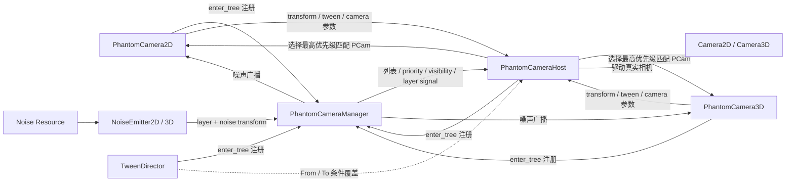

# Phantom Camera 模块文档

> **AI 修改说明**：修改本文档前先读 `docs/AI协作/文档维护指南.md` 与 `docs/代码文档规范.md`。
> 本文档是 vendored Phantom Camera 源码架构、运行时契约、本项目接入边界和维护入口的权威；改插件公共 API、signal、节点约束、本地补丁、项目适配链路或测试义务时必须同步本文档。
> 插件版本、发布包 SHA-256、许可与手工升级清单以 `client/addons/README.md` 为权威；玩家相机行为以 `docs/代码/gameplay_runtime.md`、GDD §5.2 与 ADR #148 / #156 为权威。

## 职责与边界

- Phantom Camera 是固定版本入库的 MIT Godot 插件，同时提供编辑器工具和游戏运行时摄像机 API。
- 插件把“相机意图”放在 `PhantomCamera2D` / `PhantomCamera3D`，由 `PhantomCameraHost` 选出当前有效意图，再驱动真正的 `Camera2D` / `Camera3D`。
- `PhantomCameraManager` 负责节点注册、优先级变化、层匹配、噪声广播和编辑器 Viewfinder 协调；它不是玩法状态或项目通用事件总线。
- 本项目只在正式玩法中使用 2D 路径和位移震屏。3D、Tween Director、Viewfinder、Gizmo、Inspector 与 C# wrapper 保留为插件完整能力，但不是当前玩家相机链路。
- `client/scripts/gameplay/gameplay_camera_controller.gd` 是项目适配层：它决定严格居中参数、读取数据、响应 Settings，并把有效玩家伤害映射到插件 API。不要把这些项目规则搬进 vendored 通用类。
- 插件不负责瞄准换算、伤害判定、玩家设置持久化、数据 schema、存档、回放或玩法随机；这些继续由项目正式系统负责。

## 阅读方式

| 你想做什么 | 先看哪里 |
|------------|----------|
| 调玩家相机、严格居中或震屏 | 本文档“本项目正式 2D 接入” → `docs/代码/gameplay_runtime.md` → `gameplay_camera_controller.gd` |
| 理解 PCam 如何变成真实相机画面 | 本文档“运行流程” → Manager、Host、目标 PCam 源码 |
| 新增第二台 2D PCam 或切镜头 | `PhantomCamera2D`、`PhantomCameraHost` 与优先级 / layer 契约 |
| 使用 3D、第三人称或 Spring Arm | `PhantomCamera3D`、`Camera3DResource`；先新增项目设计与测试决策，不能直接改正式 2D 玩家链路 |
| 改震屏算法或随机种子 | Noise Resource、Emitter、`phantom_camera_seed_source.gd` 与项目 `RNG.camera_fx` 契约 |
| 改编辑器 Viewfinder / Gizmo / Updater | `plugin.gd`、`scripts/panel/`、`scripts/gizmos/`；Updater 必须保持关闭 |
| 升级插件 | `client/addons/README.md` 的固定版本与升级流程，再按本文档“本地补丁与升级”逐项重放 |

## 代码地图

| 区域 | 主要路径 | 作用 |
|------|----------|------|
| 插件入口 | `client/addons/phantom_camera/plugin.gd`、`plugin.cfg` | 注册自定义节点、底部面板、3D Gizmo 和插件设置 |
| 运行时中枢 | `scripts/managers/phantom_camera_manager.gd` | 项目固定 autoload；维护 Host、2D/3D PCam、Tween Director 列表并转发协调 signal |
| 真实相机适配 | `scripts/phantom_camera_host/phantom_camera_host.gd` | 必须作为真实 Camera 的直接子节点；按 host layer、可见性与 priority 选择 PCam |
| 虚拟相机 | `scripts/phantom_camera/phantom_camera_2d.gd`、`phantom_camera_3d.gd` | 计算目标 transform、跟随、阻尼、取景、限制、噪声和过渡参数 |
| 行为节点 | `phantom_camera_noise_emitter_2d.gd`、`phantom_camera_noise_emitter_3d.gd`、`phantom_camera_tween_director.gd` | 触发一次性 / 持续噪声，或按 From/To 条件覆盖切镜 Tween |
| 行为资源 | `scripts/resources/` | 2D/3D Noise、Tween、Tween Director 条件和 Camera3D 参数资源 |
| 项目随机适配 | `scripts/phantom_camera_seed_source.gd` | 运行时从 `RNG.camera_fx` 取 seed；编辑器使用不影响玩法的确定性本地序列 |
| 编辑器工具 | `scripts/panel/`、`scripts/gizmos/`、`inspector/` 与对应场景 | Viewfinder 预览、Host 列表、优先级覆盖、3D Gizmo、Inspector 和手工更新 UI |
| C# wrapper | 同目录的 `*.cs` | 对 GDScript runtime/resource API 的 .NET 包装；当前非 .NET 项目不执行 |
| 项目适配层 | `client/scenes/gameplay/gameplay_camera_controller.tscn`、`client/scripts/gameplay/gameplay_camera_controller.gd` | 固定正式玩家 2D 节点树、参数、数据和受伤震屏策略 |

## 架构与数据流



### 节点注册与选机

1. Manager autoload 进入树后注册同名 Engine singleton，并维护当前 SceneTree 中的 Host、PCam 和 Tween Director 列表。
2. Host 与 PCam 在 `_enter_tree()` 注册、在 `_exit_tree()` 注销；Host 必须能在根节点找到 `PhantomCameraManager`。
3. Host 只考虑与自身 `host_layers` 至少有一位相交、当前可见且维度匹配的 PCam。
4. Host 选择 priority 最高者；激活变化触发 inactive / active signal 并按新 PCam 的 Tween 参数过渡。相同 priority 的选择会受节点注册 / 遍历顺序影响，项目代码应避免依赖平级竞争。
5. Host 把激活 PCam 的 transform、zoom 或 3D camera resource 参数写到真实 Camera；PCam 本身不替代真实 Camera。

### 帧更新与插值

- PCam 根据 Follow / Look At 模式计算输出 transform。目标属于物理节点时，Host 的 `AUTO` 模式会选择物理更新；也可固定为 `IDLE`、`PHYSICS` 或由调用方使用 `MANUAL`。
- Host 会关闭 `Camera2D.position_smoothing_enabled`，避免 Godot 原生 smoothing 与 PCam 插值叠加。
- `teleport_position()` 用于目标瞬移或首次绑定后立即同步，防止从旧位置插值穿场。
- 非激活 PCam 的 `InactiveUpdateMode` 可选 `ALWAYS` 或 `NEVER`。准备无缝切镜时需要评估 inactive 更新策略。

### 噪声

1. `PhantomCameraNoise2D/3D` 保存 amplitude、frequency、seed、位置 / 旋转开关和各轴 multiplier，并按 trauma 生成 transform。
2. Emitter 的 `emit()` 启动 growth → duration → decay 生命周期；`continuous=true` 时持续到显式停止。
3. Emitter 通过 Manager 广播 noise transform 与 `noise_emitter_layer`；只有 layer 相交的 PCam 接收。
4. Host 把激活 PCam 的噪声输出应用到真实 Camera。`stop(false)` 必须立即清 trauma、重置噪声时间并停止后续偏移。
5. `randomize_noise_seed=true` 时，运行时 seed 必须来自 `RNG.camera_fx`；不得改回全局 `randi()` 或共享玩法子流。

## 场景 / 节点结构

### 通用 2D

```text
SceneRoot (Node2D)
├── RealCamera (Camera2D)
│   └── PhantomCameraHost
├── CameraA (PhantomCamera2D)
├── CameraB (PhantomCamera2D，可选)
└── ShakeEmitter (PhantomCameraNoiseEmitter2D，可选)
```

### 通用 3D

```text
SceneRoot (Node3D)
├── RealCamera (Camera3D)
│   └── PhantomCameraHost
├── CameraA (PhantomCamera3D)
├── CameraB (PhantomCamera3D，可选)
├── TweenDirector (PhantomCameraTweenDirector，可选)
└── ShakeEmitter (PhantomCameraNoiseEmitter3D，可选)
```

- 每个真实 Camera 只使用第一个直接子级 `PhantomCameraHost`；多 Host 会产生配置警告。
- Host 与 PCam 的 layer 必须相交；Emitter 与 PCam 的 noise layer 也必须相交。这是两组不同 mask，不能混为一谈。
- 3D `THIRD_PERSON` 模式内部使用 Spring Arm / shape / collision mask 语义；它与当前正式 2D Player 无关。

### 本项目正式 2D 接入

```text
GameplayRunLoop (Node2D)
└── ActiveWorld (Node2D)
    ├── PlayerHost (Node2D)
    │   └── Player (character-specific CharacterBody2D)
    └── GameplayCameraController (Node2D)
        ├── CenteredCamera (Camera2D)
        │   └── PhantomCameraHost
        ├── PlayerCamera (PhantomCamera2D)
        └── PlayerDamageShake (PhantomCameraNoiseEmitter2D)
            └── PhantomCameraNoise2D resource
```

项目固定约束：

- `PlayerCamera` 使用 `FollowMode.GLUED`、priority `10`、host/noise layer `1` 和 `Vector2.ONE` zoom。
- 禁用 Camera smoothing、PCam damping、lookahead、auto zoom、目标旋转跟随、rotation damping、load tween 和有效时长 Tween；真实 Camera 保持 `ignore_rotation=true`、`rotation=0`。
- `GameplayCameraController` 是 `ActiveWorld` 的对局级长期节点，不是 Player 子节点；角色专属场景不得携带第二份 Rig。
- `GameplayRunLoop` 每次实例化默认角色或恢复快照角色后调用 `GameplayCameraController.configure()`，重新绑定 Player 并立即 `teleport_position()`；控制器同时从 `camera_feedback.json.player_damage_shake` 写入 Noise 与 Emitter。
- `GameplayRunLoop` 只在 `Combat.damage_applied` 确认玩家实际受伤后调用 `play_player_damage_shake()`；敌人受伤和玩家无敌拦截不触发。
- `gameplay.screen_shake=false` 会立即 `stop(false)`、归零 `Camera2D.offset` 并抑制后续震屏。
- 鼠标瞄准使用当前 canvas transform 反算世界方向；禁止用震屏偏移直接修改玩家的世界瞄准向量。
- `Engine.physics_jitter_fix` 由项目保持 `0.5`；插件不得覆盖全局引擎值。

## 公共契约

### Manager 与 Host

| 类型 / 能力 | 主要 API / 属性 | 契约 |
|-------------|-----------------|------|
| `PhantomCameraManager` 节点列表 | `phantom_camera_hosts`、`phantom_camera_2ds`、`phantom_camera_3ds`、`phantom_camera_tween_directors` 与 `get_*()` | 只读当前已注册节点；节点自行负责成对注册 / 注销 |
| Manager 注册 | `pcam_host_added/removed()`、`pcam_added/removed()`、`pcam_tween_director_added/removed()` | 只接受对应节点类型；错误调用打印错误，不应作为项目业务 API 使用 |
| Manager 编辑器协调 | `set_viewfinder()`、`get_viewfinder()`、`scene_changed()` | 供 addon 内部使用；`scene_changed()` 清空场景节点缓存 |
| `PhantomCameraHost` 过滤 | `host_layers`、`set_host_layers_value()` | 与 PCam `host_layers` 做位 mask 相交 |
| Host 更新模式 | `interpolation_mode`、`process(delta)` | `MANUAL` 时由调用方驱动；其他模式由 Host 自行调度 |
| Host 当前 PCam | `get_active_pcam()` | 返回当前维度的激活 PCam 或 `null` |
| Host 刷新 | `pcam_priority_updated()` | priority 变化后重新判断；正常应由 PCam setter 经 Manager signal 触发 |

### PhantomCamera2D

| 能力 | 属性 / API | 说明 |
|------|------------|------|
| 激活与路由 | `priority`、`visible`、`host_layers`、`is_active()` | Host 只选择可见、layer 匹配的最高 priority PCam |
| 跟随模式 | `FollowMode.NONE / GLUED / SIMPLE / GROUP / PATH / FRAMED` | 分别表示无跟随、粘附、单目标、目标组、Path2D 约束和 dead-zone 取景 |
| 目标管理 | `set/get/erase_follow_target()`、`set/get/erase_follow_path()`、`set/append/erase/get_follow_targets()` | 单目标、路径和目标组按 FollowMode 使用；目标退出树时会清理连接 |
| 运动构图 | offset、damping、axis lock、rotation、snap-to-pixel、auto zoom、lookahead、dead zone、limit | setter 会更新内部状态和必要的 Manager / Viewfinder signal |
| 切镜 | `tween_resource`、duration、transition、ease、`tween_on_load`、`set_tween_skip()` | Host 激活切换时读取；Tween Resource 是共享参数容器 |
| 瞬移与输出 | `teleport_position()`、`get_transform_output()`、`get_noise_transform()`、`emit_noise()` | Host 消费 transform；项目首次绑定后必须 teleport |
| 噪声 | `noise`、`noise_emitter_layer`、`has_noise_resource()` | 自带连续 Noise 或接收匹配 Emitter 的广播 |

### PhantomCamera3D

3D 路径共享 priority、host layer、Tween、inactive update、teleport 和 Noise 契约，并额外提供：

- `FollowMode.NONE / GLUED / SIMPLE / GROUP / PATH / FRAMED / THIRD_PERSON`；第三人称支持 orbit、follow distance、Spring Arm、collision mask、shape 与 margin。
- `LookAtMode.NONE / MIMIC / SIMPLE / GROUP`，支持 look-at target/group、offset、damping、up vector 和 up target。
- `Camera3DResource` 与 environment、attributes、compositor、projection、FOV、size、near/far、cull mask 等真实 `Camera3D` 参数映射。
- 当前项目没有正式 3D Camera Host。启用前必须新增场景、行为验收和对应模块文档联动，不能假定 2D smoke 已覆盖。

### Noise、Tween 与 Director

| 类型 | 关键契约 |
|------|----------|
| `PhantomCameraNoise2D/3D` | `set_trauma()` 控制强度；`get_noise_transform(delta)` 产出 transform；`reset_noise_time()` 清时间状态。2D 支持位置 XY / 单旋转轴，3D 支持位置与旋转 XYZ |
| `PhantomCameraNoiseEmitter2D/3D` | `emit()`、`stop(should_decay=true)`、`toggle()`、`is_emitting()`；growth/duration/decay 单位为秒，layer 决定接收者 |
| `PhantomCameraTween` | duration + Godot Tween transition/ease 枚举；作为 PCam 默认切镜参数或 Director 匹配条件 |
| `TweenDirectorResource` | 用 `PHANTOM_CAMERA`、`TWEEN_RESOURCE` 或 `ANY` 匹配 From / To，再提供覆盖 Tween |
| `PhantomCameraTweenDirector` | 场景级条件表；Host 切镜时查找匹配覆盖，不直接驱动真实 Camera |
| `Camera3DResource` | 共享 3D Camera 参数；属性变化通过 signal 传播到激活 3D 路径 |

## Signal / Event

| 来源 | 重要 signal | 用途 |
|------|-------------|------|
| Manager | `pcam_host_added_to_scene` / `removed`、`pcam_added_to_scene` / `removed` | Host、PCam 与 Viewfinder 维护场景列表 |
| Manager | `pcam_priority_changed`、`pcam_visibility_changed`、`pcam_host_layer_changed`、`pcam_teleport` | 促使 Host 重新选机或同步 transform |
| Manager | `noise_2d_emitted`、`noise_3d_emitted` | 按 Emitter layer 广播噪声 transform |
| Host | `pcam_became_active`、`pcam_became_inactive` | 通知真实 Camera 所属 Host 的激活切换 |
| PCam 2D/3D | `became_active`、`became_inactive`、`follow_mode_changed`、`follow_target_changed` | 节点自身生命周期 / 配置变化 |
| PCam 2D/3D | `tween_started`、`is_tweening`、`tween_interrupted`、`tween_completed` | 切镜状态；项目逻辑不应靠轮询私有 Tween 字段 |
| PCam 2D/3D | `noise_emitted`、`physics_target_changed` | Noise 输出和 AUTO 插值模式更新 |
| PCam 3D | `look_at_target_changed`、`camera_3d_resource_property_changed`、`camera_3d_resource_changed` | 3D 专用配置传播 |

`viewfinder_*`、dead-zone 绘制和 priority override signal 属于编辑器协调面，正式玩法不要订阅它们作为业务事件。

## 数据、设置与确定性

- 插件自身 Resource 没有项目 JSON schema；本项目可调震屏参数只来自 `client/data/camera_feedback.json`，字段说明与校验归 `client/data/README.md` 和 DataLoader 双端 schema 管理。
- 玩家设置键来自生成常量 `SETTINGS_KEYS.GAMEPLAY_SCREEN_SHAKE`；插件源码不得裸写项目 setting id。
- 运行时随机必须走 `RNG.camera_fx`。该子流只影响表现，不得改变 `spawn`、`drop`、`combat`、`world` 等确定性序列。
- 相机与震屏当前不写入 run snapshot；恢复局内状态后由 RunLoop 将场景预置 Rig 重新绑定到新建 Player。不要保存 Noise 的瞬时 phase，除非未来新增明确回放 / 存档决策。
- 插件 updater 设置固定为 `phantom_camera/updater/updater_mode=0`，不会发出版本查询；升级只能走人工审查。

## 编辑器工具与 C# 边界

- `plugin.gd` 注册六类自定义节点、Phantom Camera 底部面板和两个 3D Gizmo；禁用时只移除编辑器注册，不得删除项目固定 `PhantomCameraManager` autoload。
- Viewfinder 读取 Manager 场景列表，在 SubViewport 中镜像真实 Camera，显示 dead zone、目标点、Host 列表和仅编辑器生效的 priority override。
- Inspector / Gizmo 只改善编辑期可视化；它们不是导出运行时依赖的业务入口。
- Updater 源码保留上游手工下载界面，但项目模式 `0` 会在网络请求前返回。禁止恢复自动下载、自动覆盖 addon 或自动重启编辑器。
- C# wrapper 与 GDScript 类型同包保留，便于上游完整性和未来审查；当前 `client/` 不是 .NET 项目，文档以 GDScript 实现为准。若未来启用 C#，必须单独验证 wrapper 与本地补丁等价性。

## 依赖与禁止项

上游依赖：Godot SceneTree、真实 Camera、Engine singleton、Tween、FastNoiseLite、EditorPlugin API。项目额外依赖：`RNG.camera_fx`、Settings、DataLoader、Combat 和 Gameplay Runtime 适配层。

禁止：

- 禁止让插件开关动态增删 `PhantomCameraManager` autoload；`client/project.godot` 是项目所有权来源。
- 禁止恢复插件对 `Engine.physics_jitter_fix` 的覆写。
- 禁止启用 updater、直接覆盖 vendored 目录或从上游默认分支滚动更新。
- 禁止为 addon 添加 lint 排除、warning 白名单或弱化项目强类型规则。
- 禁止在通用插件脚本读取 `camera_feedback.json`、伤害事件或项目 Settings；这些属于 `GameplayCameraController`。
- 禁止把 Noise seed 接到 gameplay RNG 子流或全局非确定性 API。
- 禁止修改 C# wrapper 来“修复”当前 GDScript 运行时，除非任务明确覆盖 .NET 路径。

## 本地补丁与升级

完整版本、哈希和补丁摘要见 `client/addons/README.md`。源码级维护必须保留以下差异：

1. 项目强类型与成员顺序补丁，以及 4 个 C# wrapper 的上游行尾空白清理。
2. `Object.is_class(StringName)` 的 Godot 4.7.1 签名适配。
3. `phantom_camera_seed_source.gd`：运行时 `RNG.camera_fx`，编辑器确定性本地 seed。
4. 删除插件对 `Engine.physics_jitter_fix` 的全局覆写，项目值保持 `0.5`。
5. Emitter `stop(false)` 立即清 trauma / noise time。
6. 编辑器插件不自动增删 autoload、不自动重启；Updater mode 固定为 `0`。
7. 本文档所列核心 GDScript 入口保留 `# Doc` / `# Authority` 文件头。

升级时只从明确版本的官方发布包提取 `addons/phantom_camera/`，继续排除 `examples/`；在仓库外比较上游差异，逐项重放补丁，再更新插件清单、Credits、相关 ADR / 记忆和验证记录。不要用整个目录覆盖后再猜测哪些本地差异丢失。

## 扩展点与常见改动入口

| 你想改什么 | 主要入口 | 同步文档 | 验证 |
|------------|----------|----------|------|
| 调玩家受伤震屏数值 | `client/data/camera_feedback.json` | `client/data/README.md`，必要时 Gameplay Runtime | data/schema + settings/runtime smoke + headless |
| 改玩家跟随、缩放或震屏触发边界 | `gameplay_camera_controller.gd/.tscn`、`gameplay_run_loop.gd` | Gameplay Runtime、本文档、必要时 GDD / ADR | 测试策略“玩家相机”整行义务 |
| 增加第二台 2D PCam / 切镜 | 项目场景 + `PhantomCamera2D` priority/layer/Tween | 本文档、Gameplay Runtime、AI 导航依赖图 | runtime smoke + headless editor + 人工切镜 |
| 修改通用 Follow / Host / Noise 算法 | 对应 addon core script | 本文档、插件 README 本地补丁 | lint + 完整相机 smoke + headless editor；行为稳定性变化评估 replay |
| 启用 3D 正式路径 | 新项目场景 + `PhantomCamera3D` / `Camera3DResource` | 新设计 / ADR、本文档、测试策略 | 新增 3D 自动与人工验收，不能只跑现有 2D smoke |
| 修改 Viewfinder / Gizmo / Updater | `plugin.gd`、`scripts/panel/`、`scripts/gizmos/` | 本文档、插件 README | headless editor + Godot 交互验收；Updater 仍须为 Off |
| 升级上游版本 | 官方固定发布包 + addon 全目录 | 插件 README、本文档、Credits、ADR / 记忆 | 完整 pre-commit、headless、editor 与相机回归 |

## 故障排查

| 现象 | 优先检查 |
|------|----------|
| Host 报错或 Camera 不动 | Host 是否是 Camera 的直接子节点；`PhantomCameraManager` autoload 是否存在；Host/PCam layer 是否相交 |
| 激活了错误 PCam | 可见性、priority、host layer；是否存在同 priority PCam；查看 Manager 当前列表和 Host `get_active_pcam()` |
| 首帧从旧位置滑入 | 绑定 target 后是否调用 `teleport_position()`；是否误开 `tween_on_load` |
| 相机双重平滑或拖尾 | Camera 原生 smoothing 是否关闭；PCam damping/lookahead/Tween 是否意外开启；Host interpolation mode 是否符合目标节点 |
| 震屏没有出现 | Emitter 是否有 Noise Resource；Emitter/PCam noise layer 是否相交；Settings 是否关闭；是否确实产生玩家有效伤害 |
| 关闭震屏后仍有偏移 | 是否调用 `stop(false)` 并归零真实 `Camera2D.offset`；本地补丁是否在升级时丢失 |
| 回放 / seed 摘要异常 | `phantom_camera_seed_source.gd` 是否仍使用 `RNG.camera_fx`，是否误用了其他 RNG 子流 |
| 新 clone 出现全局类型解析错误 | 使用 `tools/godot_bridge.py --project client headless-boot` 的两阶段 editor scan；不要依赖旧 `.godot/global_script_class_cache.cfg` |
| 编辑器尝试联网或显示升级 | 确认 `phantom_camera/updater/updater_mode=0`，并检查 Updater mode `0` 是否仍在 HTTP request 前返回 |
| 3D 导出模板解析问题 | 3D 列表刻意以 `Node` 弱类型兼容 `disable_3d` 模板；不要为了形式强类型破坏该边界 |

## 测试义务

- 只改本文档或核心入口注释：运行 docs health、JSON 校验、GDScript lint、完整 pre-commit 与 `headless-boot`，确认 `@tool` 脚本仍可解析。
- 改玩家相机、Plugin Runtime 或 `camera_feedback.json`：按 `docs/测试策略.md` 的“改玩家相机 / Phantom Camera / 受伤震屏”执行 `validate_data`、schema、`settings-smoke`、`runtime-smoke`、`headless-boot` 和 headless editor 加载；人工检查严格居中与震屏可读性。
- 改 RNG seed 路径：追加 `rng-audit`，并评估四条 checked-in replay；只有稳定摘要变化时才按项目流程重录。
- 改 EditorPlugin / Viewfinder / Gizmo / Updater：除 headless editor 外，手工打开 Phantom Camera 面板，检查 Host、active PCam、dead zone / target 预览与重启后的插件状态。
- 不因本模块自动运行性能 probe；遵守 ADR #143，仅在用户当次明确要求时采样性能。

## 迁移 / 兼容

- 当前插件接入不新增存档字段、回放字段或数据 schema；相机状态从场景和配置重建。
- `res://addons/phantom_camera/`、`PhantomCameraManager` autoload 名称和核心 `class_name` 是稳定路径 / 类型契约。重命名会影响场景资源、UID、脚本解析和 C# wrapper，必须作为显式迁移处理。
- 升级不得删除 UID、LICENSE、C# wrapper 或插件运行时资源；是否继续排除上游 examples 由插件入库边界决定。
- 若上游改变 API、signal、节点父子要求、Manager 注册方式、Updater 或 seed 行为，先更新本文档和项目适配层，再决定是否升级；不能以“上游最新版”为理由静默改变正式相机行为。

## 相关文档

- `client/addons/README.md`：版本、SHA-256、许可、本地补丁和人工升级权威。
- `docs/代码/gameplay_runtime.md`：正式 Player 相机与受伤反馈行为权威。
- `docs/游戏设计文档.md` §5.2：玩家可感知相机设计。
- `docs/决策记录.md` ADR #148：引入 Phantom Camera 与维护型 fork 的决策。
- `client/data/README.md`：`camera_feedback.json` 字段和 schema。
- `docs/代码/rng.md`、`docs/代码/settings.md`、`docs/代码/combat.md`：项目依赖契约。
- `docs/测试策略.md`：相机改动测试义务权威。
