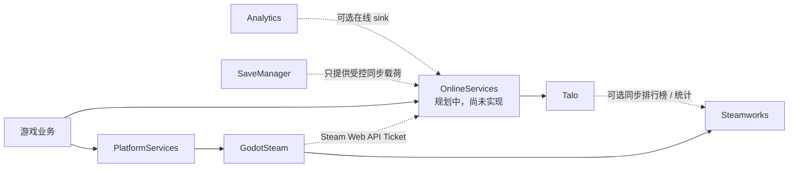

# 在线服务规划

> **AI 修改说明**：修改本文档前先读 `docs/AI协作/文档维护指南.md`。
> 本文档的权威范围：记录正式客户端未来采用 GodotSteam + Talo 的在线服务供应商、职责分层、实施门禁、离线与安全边界；不代表插件已安装，也不批准任何具体在线玩法。
> 常见联动：`docs/游戏设计文档.md`、`docs/决策记录.md`、`docs/代码/platform_services.md`、`docs/测试策略.md`、`docs/AI导航.md`、`docs/小服务器玩法备忘.md` 与 AI 记忆。

---

## 0. 当前结论

- 正式 `client/` 当前保持单人离线，不安装、下载或启用 GodotSteam / Talo，不创建账号、Access Key、Steam 后台配置或云端资源。
- 未来需要 Steam 平台能力时采用 **GodotSteam**；需要通用在线后端时采用 **Talo**。项目不开发自有通用后端。
- Talo Cloud 与官方自托管发行版都是允许的部署候选，实施前再按成本、数据驻留、可用性与运维能力选定；无论选择哪一种，都不扩展成自研后台。
- 供应商路线已经由 ADR #150 采纳，但每日挑战、排行榜、死亡残响、实时联机等具体功能仍未批准、未排期。只有用户点名首个功能后才进入实施。
- `output/steamworks_lab/` 是现有独立实验应用，不等于正式 `client/PlatformServices` 已接入，也不作为直接复制进正式项目的插件来源。

## 1. 服务拓扑与职责

| 层 | 未来职责 | 明确不负责 |
|----|----------|------------|
| `PlatformServices` | Steam 初始化、回调、平台用户、Web API Ticket、成就、Steam-only 统计、富状态、Overlay、Lobby、邀请与平台联机入口 | 通用排行榜、Live Config、事件分析、游戏同步协议 |
| GodotSteam | `PlatformServices` 背后的 Steamworks SDK adapter | 被业务脚本直接调用、承担跨平台后端 |
| `OnlineServices`（规划中） | Talo 可用性、玩家识别、跨平台排行榜 / 统计、Live Config、事件上传、轻量社交与离线降级门面 | Steam 初始化、直接控制存档 schema、权威战斗服务器 |
| Talo | `OnlineServices` 背后的托管或官方自托管后端；可验证 Steam 身份并按配置同步 Steamworks 排行榜 / 统计 | 成为业务代码的直接依赖、替代 `SaveManager`、提供强竞技反作弊承诺 |
| `Analytics` | 继续作为业务埋点唯一入口；未来可把 Talo 作为一个可关闭的在线 sink | 让玩法代码直接调用 Talo events |
| `SaveManager` | 本地存档 envelope、schema、迁移、原子写入、备份、损坏隔离与本地权威 | 让 Talo Saves 或 Steam Cloud 接管存档结构 |

## 2. 单一写入权威

同一能力只能有一个写入权威，禁止客户端和 Talo 各写一次再依赖双向同步消除冲突。

| 能力 | 默认权威 | 规则 |
|------|----------|------|
| Steam 成就、富状态、Overlay、Lobby、邀请 | GodotSteam / `PlatformServices` | 只走 Steam 平台 adapter |
| Steam-only 统计 | GodotSteam / `PlatformServices` | 仅在不需要跨平台汇总时使用 |
| 跨平台排行榜、全局 / 玩家统计 | Talo / `OnlineServices` | 若开启 Talo → Steamworks 同步，客户端不得再直接提交同一排行榜或统计 |
| Live Config、事件上传、玩家关系 / 在线状态 | Talo / `OnlineServices` | 玩法必须提供离线默认值或缓存退化 |
| 本地进度 | `SaveManager` | 云端只能同步完整、已校验的 `SaveManager` 载荷；具体云同步供应商另行决策 |

每个正式在线功能的 ADR 必须明确：数据所有者、写入权威、离线行为、重复请求幂等性、隐私开关与删除 / 导出路径。

## 3. Steam 身份链路

1. `PlatformServices` 内的 GodotSteam adapter 负责且只负责一次 Steam 初始化与 callback 驱动。
2. `PlatformServices` 为用途明确的调用方申请 Steam Web API Ticket；Talo 身份验证使用与请求时相同的 ticket identity。
3. 规划中的 `OnlineServices` 接收票据并调用 Talo 的 Steam identification；业务 UI 不读取 `Steam.*` 或 `Talo.*`。
4. Talo 返回的玩家身份映射保存在在线服务会话中，不写入 `run`；需要持久化的最小标识必须经过隐私与迁移设计。
5. Steam 不可用、票据失败或 Talo 不可达时，在线功能降级，单机启动、游玩、本地保存和回放继续可用。

Talo 官方文档明确支持通过 GodotSteam 获取的 Web API Ticket 识别 Steam 玩家，并支持将排行榜 / 统计映射到 Steamworks：

- [Talo Godot Steam 身份识别](https://docs.trytalo.com/docs/godot/identifying#steamworks-integration)
- [Talo Steamworks 集成](https://docs.trytalo.com/docs/integrations/steamworks)

## 4. 离线、存档与确定性

- 在线能力必须是附加能力，不得成为进入标题、开始普通单机局、暂停保存、续局或播放本地回放的前置条件。
- Live Config 必须有内置安全默认值；缓存过期、签名失败或 schema 不兼容时使用本地配置并记录诊断，不静默执行未知字段。
- 上传失败可以排队重试，但队列必须有大小、生命周期、玩家身份与退出清理边界；不得无限增长或跨账号误投。
- 排行榜、事件和全局统计不进入确定性 gameplay tick，不改变 `RNG`、`GameClock` 或回放结果。每日 seed 等输入必须先形成可记录的数据快照，再开始一局。
- Talo Continuity 可以作为网络恢复能力，但不能取代项目自己的离线产品规则和错误处理。[Talo Continuity 文档](https://docs.trytalo.com/docs/godot/continuity)
- Talo Saves 首版默认不采用。未来需要云存档时，只同步 `SaveManager` 已生成并验证的 envelope，冲突策略和供应商必须另立 ADR。

## 5. 安全、隐私与凭据

- Talo Access Key 使用完成目标功能所需的最小 scopes；不为方便授予未使用权限。
- Steam Web API Publisher Key、Talo 后台管理凭据、数据库凭据、邮件服务凭据和其他服务端秘密不得放入客户端、仓库、回放、存档或日志。
- 客户端内的 access key / request verification material 可被提取，因此请求签名只作为提高滥用成本的校验层，不作为权威反作弊。
- 强竞技排行榜、可交易经济、服务器权威 PvP / PvE 和敏感账号系统必须另行评估；当前供应商决策不批准这些能力。
- 事件上传必须继续受项目“数据收集”设置控制；新增字段前写明用途、保留时间、可选 / 必需属性以及账号删除 / 数据导出路径。
- 日志默认不输出票据、session token、Access Key、邮箱或其他个人数据；诊断使用脱敏 id 和错误码。

## 6. 托管方式决策门禁

实施首个 Talo 功能前，必须在单独 ADR 中从以下候选中选择一种：

| 候选 | 适用条件 | 代价 |
|------|----------|------|
| Talo Cloud | 希望最少运维、快速验证、当前玩家规模和预算适配官方套餐 | 依赖外部托管、需确认条款、数据驻留和费用增长 |
| 官方自托管 Talo | 有明确数据驻留、成本、定制部署或可用性要求，并能承担 Docker、数据库、备份、监控和安全更新 | 需要持续运维，但仍使用 Talo 官方代码与 API，不开发自有通用后端 |

决策输入至少包括预计活跃玩家、请求量、存储量、目标地区、备份 / 恢复目标、监控告警、升级窗口和年度总成本。官方自托管入口见 [Talo Self-hosting](https://docs.trytalo.com/docs/selfhosting/overview)。

## 7. 来源、版本与升级

- 当前只锁技术路线，不锁未来安装版本。实施时重新核验 Godot 4.7.x、GodotSteam、Steamworks SDK 与 Talo 的最新兼容矩阵。
- GodotSteam 旧 GitHub 仓库已归档并指向 Codeberg；未来只从届时的官方维护来源取得发布包，旧 GitHub 仅作迁移入口：[GodotSteam GitHub archive](https://github.com/GodotSteam/GodotSteam)、[GodotSteam Codeberg](https://codeberg.org/godotsteam/godotsteam)。
- Talo 只从官方文档、官方 Godot 仓库或 Godot Asset Store 官方发布条目取得；不复制未知 fork。
- 正式接入时记录版本、来源 URL、发布包 SHA-256、许可证、notice、本地补丁和升级步骤；禁用自动更新，升级走人工差异审查与兼容验证。
- 现有 `output/steamworks_lab/` 可提供 GodotSteam 行为与发布验证经验，但正式 `client/` 必须单独固定来源和接入 adapter，不直接把 Lab 目录复制进去。

## 8. 实施阶段与验收

只有用户点名首个在线功能后才执行以下阶段：

1. **重新调研**：核验官方来源、版本、许可证、价格 / 托管条款、数据驻留和目标功能能力。
2. **隔离验证**：GodotSteam 复用现有 Steamworks Lab 验证；Talo 在 `output/test_lab` 独立场景验证，不修改正式 `client/`。
3. **托管决策**：选择 Talo Cloud 或官方自托管，记录 ADR；禁止顺带开发自有后端。
4. **平台 adapter**：固定版本安装 GodotSteam，只在 `PlatformServices` 内接 Steam 初始化、callback、身份与首个被批准的平台能力。
5. **在线门面**：固定版本安装 Talo，新增 `OnlineServices` 与最小 provider adapter；先完成 Steam 票据身份、可用性和离线退化。
6. **单功能纵切**：只实现一个已批准功能，首选低风险异步能力；建立单一写入权威、schema、隐私开关、幂等和失败重试。
7. **正式验收**：覆盖无 Steam、Steam 离线、无网络、Talo 故障、连接恢复、重复请求、账号切换、客户端退出、凭据泄漏扫描，以及普通单机 / 本地存档 / 回放不回归。

## 9. 当前不在范围

- 不安装或启用插件，不修改 `client/project.godot`、`client/addons/`、autoload、数据 schema、locale、Credits 或运行时代码。
- 不创建 Talo / Steam 后台账号、Access Key、排行榜、统计、应用配置或真实在线资源。
- 不批准每日挑战、排行榜、死亡残响、星域污染图、实时合作、PvP、交易经济或强竞技反作弊。
- 不创建 `OnlineServices` autoload 或公共 API；本文只固定未来职责和门禁。

## 10. 相关文档

- `docs/游戏设计文档.md` §6.7 / §9.22 / §9.23
- `docs/决策记录.md` ADR #84 / #150
- `docs/代码/platform_services.md`
- `docs/代码/analytics.md`
- `docs/代码/save_manager.md`
- `docs/小服务器玩法备忘.md`
- `docs/测试策略.md`
- `output/steamworks_lab/README.md`
